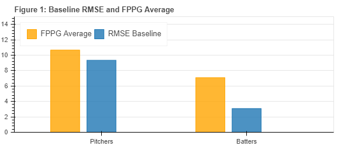
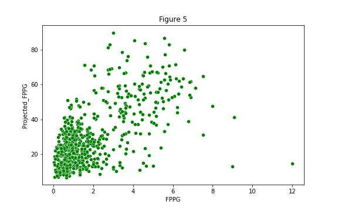

# MLB Fantasy Points Per Game Predictor
---
### Table of Contents

- Problem Statement
- Executive Summary
- Modeling Process
- Application
- Conclusion and Recommendations
- File Directory
- Data and Data Dictionary

---

### Problem Statement

The goal of this project is to build a regression model to predict fantasy points per game for MLB players in the current 2021 season.  This model will be evaluated using RMSE and the model should improve upon the baseline by at least 25%.  The model’s predictions and coefficients will be used to create a lineup building application. The application will provide a MLB daily fantasy lineup for a user.  This product is geared towards companies that provide services to fantasy players.  The product can be used in trial periods for potential users or as a product offered to existing users. 

### [Product Application Link](https://share.streamlit.io/patrickwcudo/dfs_mlb_fppg_predictor/Application/FPPG_Predictor_Application.py)

---

### Executive Summary

According to the baseball hall of fame, “fantasy baseball now involves more than 10 percent of the US population.”  This equates to over 32 million people currently, which help generate revenues approaching 4-billion for league entry fees, digital game management, player scouting advice, consumer advertising and payouts to top performers.  As a fan of both the actual sport and the fantasy game I used my newly acquired data science skills to explore the game further with this project.

First I will define what exactly fantasy points are for readers who may not know.   The game of fantasy baseball is fairly simple, users enter a lineup that meet position requirements and compete against each other with their lineup.  The positions are exactly the same as a typical baseball lineup with pitchers, catchers, frist basemen, etc.  Salaries are assigned to each player based on recent performance and users have to not exceed the salary cap when selecting a lineup, so a user can not simply pick the best players as they will exceed the cap.  Points are assigned to specific statistics and are awarded as players record them.  For example, if a player hits a homerun and the points assigned to that stats is 12 points the player will be awarded 12 fantasy points.  The user with the highest score at the end of the day wins.

The following workflow was followed during this project: data collection, EDA and cleaning, modeling, application creation, and conclusions.  First the data was collected from two websites fangraphs.com and fantasydata.com.  These two sources were used as fangraphs provided previous years data and a mulitude of statistics. Whereas, fantasydata.com provides fantasy points for players.  With that these two datasets had to be combined, which was the majority of the cleaning.  It is also important to note for this project the previous two years of statistics will be used to train the models and they will be tested with this years’ statistics.  Since pitchers and batters have different statistics the combined data will be split and each group will have their own model.

The first step in the modeling process was to create a baseline model and record the RMSE.  The RMSE will be the metric used to evaluate the models’ performance and according the the problem stating the goal is to reduce it by at least 25%.  The next step in this process was to model across multiple linear models to gage a staring point.  Then evaluate those models and take the highest scoring model and generate predictions.  Using Linear regression the batter dataset improved 31.9% from the baseline RMSE.  Using Random Forest regressor for the pitcher dataset improved 34.2%.  The models and evaluation of them are reviewed further in the modeling section of this document. The final step in the modeling process is to generate predictions.  These predictions will be used in the application to build a fantasy baseball lineup.

The application createion process was completed using Streamlit.  The workflow for the application starts when a user imports a player list.  The application then matches up the players with their respective predictions.  Next, the application sorts by fantasy points and iterates through each positon picking the highest player if that player’s salary is less than the average remaining salary cap.  The application will then output a dataframe with the lineup and projections.  The user also as the ability to download a csv file to upload the lineup to fantasy sports websites.

In conclusion the final model provided improvement over the baseline RMSE, with a value of .982 for batters and 3.014 for pitchers.  This met the gaol of at least a 25% improvement over the baseline model for each position dataset.  Recommendations moving forward to improve the quality of the product include more data, feature engineering and splitting the problem using a generalized linear model to gather the best coefficient values and a neural to produce the best predictions.

---

### Modeling

#### Baseline

The baseline model was constructed with the average fantasy points per game of the training data set for each position group.  The figure below provides a visual of the average and RMSE for each group.

 

#### Search for the Best Model

The next step in the modeling phase is to use the data with multiple regressors and compare to the baseline.  Figure 2, below shows the batter data and the score for each regressor.  The baseline is the red line and the graph shows us that each regressor improved upon the baseline but linear regression performed the best with a RSME of 2.0962.  This is a 31.9% improvement over the baseline.  Figure 3 shows the predictions plotted against the actuals for the data set and shows some heteroscedasticity.  The heteroscedasticity shows that outliers could have been handled differently, but overall still a good improvement over the baseline.

This same process was followed for the pitcher data.  Figure 4, below shows us the pitcher data and the score for each regressor.  The baseline is the red line and the graph shows us that some regressors actually performed worse than the baseline, but some did very well.  Random forest regressor did the best with a RMSE of 6.147, which is a 34.2% improvement over  the baseline.  Below, figure 5, shows the predictions from the random forest regressor, in which there is more evidence of heteroscedasticity with the pitcher data than the batter data.  

#### GLM

A generalized linear model was used with both data sets to help gain statistical inference on the data.  The top coefficient values are shown in figure 6, below.

|Feature|Coefficient Value|
|---|---|
|BB - walks | 30.8697 |
|SO - strikeouts | 4.359 |
|IP - Innings Pitched | 30.8697 |

|Feature|Coefficient Value|
|---|---|
|AB - at-bats | 3.8836 |
|R - runs | 1.1378 |
|RBI - runs batted in| 1.0872 |

---

### Application

The application createion process was completed using Streamlit.  The workflow for the application starts when a user imports a player list.  The application then matches up the players with their respective predictions.  Next, the application sorts by fantasy points and iterates through each positon picking the highest player if that player’s salary is less than the average remaining salary cap.  The application will then output a dataframe with the lineup and projections.  The user also as the ability to download a csv file to upload the lineup to fantasy sports websites.

The application also gives the user the ability to explore the projections for each position on the position analysis page.  This page outputs a scatter plot using the Bokeh library.  The user can select all positions and show all positions at once.  This can give the user more insight into the projections.

The Lineup Builder Function is what the application uses to build a line up for the user.  The function takes the inputted player list and matches up the FPPG projections for each player.  Once this is completed the function takes the highest projected pitcher and adds that player to the line up first.  Next the function works through the rest of the positions making sure to select the highest projected FPPG for that position as long as it is not greater than the remaining average salary.  Finally the line up is saved to a dataframe and outputted for the user to view.  The application also provides a template the user can take to the fantasy sports site and upload to play in a contest.  

Another page provided on the application is the Create Lineup Stack.  This page is similar to the Create Lineup page but takes the 4 lowest projected pitchers and creates a list of teams those pitchers are facing.  The function then only selects players from those teams using the same logic described in the lineup builder function.  This gives the user another option to select based on pitching match ups.

---

### Conclusion and Recommendations

In conclusion there is enough data here to establish a base knowledge to answer our question in the problem statement. We can evaluate the coefficient values based on the model to determine what features to focus on when predicting fantasy points per game.  The final model provided improvement over the baseline RMSE, with a value of .982 for batters and 3.014 for pitchers.  This met the goal of at least a 25% improvement over the baseline model for each position dataset.  

The coefficient values provided by the GLM give us insight into the data.  For example, the coefficient value of  3.88 for at bats in the batter data is significant.  This value can formulate a strategy based on players that have a high number of at bats.  This may be selecting batters that are higher in the batting order or players on teams that on average get more at bats.  A surprising coefficient value for the pitcher data was 30.8697 for walks.  This is very significant as one walk generates almost 30 fantasy points.  In general walks are not something scored in fantasy baseball but the statistic has a very high coefficient nonetheless.  This type of insight can help when selecting a pitcher for a potential lineup and would be very useful to fantasy baseball players.

There are some points of improvement in this project.  The use of feature engineering will help with heteroscedasticity and reel in outliers.  Another recommendation is to collect more data and use this to train the model and generate predictions.  The final recommendation would be to use a neural network to generate the best possible predictions and use a generalized linear model to gather coefficient values.  All in all, with the improvement seen in the RMSE the predictions and coefficient values are still useful in the context of the model and were used with success in the application.

---

### File Directory

#### Folders/Files

* Application:
    * 04_PlayerList_Function - python notebook detailing the workflow of the lineup builder functions included in LineupBuilderFunction.py
    * FPPG_Predictor_Application - the final streamlit application
    * LineupBuilderFunction - python file that contains the lineup builders functions used in the streamlit application
    * data - folder containing csv files used in application, contained here to deploy on streamlit

* Code: 
    * 01_Combine_function - contains function used to combine data sets into the training and testing sets for each position group
    * 02_Modeling - contains the modeling for both pitcher and batters and file where predicitons were made
    * 03_GLM - generalized linear model used to analyze coefficient values
    * 03_GridSearchCV - attempt to improve model performance with gridsearchCV
    * 03_NeuralNet - attempt to improve model performance with neural networks
    * 03_PCA - attempt to improve model performance with PCA
    
* Collection_data: 
    * FanDuel - folder containing csv files of player imports from fanduel.com, used for application testing
    * FantasyData - folder containing csv files collected from fangraphs.com and fantasydata.com, which were passed through the 01_Combine_function to create the training and test data sets for pitchers and batters
    
* Modeling_Data:
    * batter_data_modeling.csv - previous two years of MLB batter statistics from 01_Combine_function
    * batter_test_data.csv - this years MLB batter statistics cleaned to match training set from 01_Combine_function
    * pitcher_data_modeling.csv - previous two years of MLB pitcher statistics from 01_Combine_function
    * pitcher_test_data.csv - this years MLB pitcher statistics cleaned to match training set from 01_Combine_function
 
* Projections:
    * batter_projections_2021.csv - batter projections from the linear regression model in 02_Modeling
    * pitcher_projections_2021.csv - pitcher projections from the random forest model in 02_Modeling
    * results_batter.csv - results of batter dataset across multiple regressor models
    * results_pitcher.csv - results of pitcher dataset across multiple regressor models

* Scrap_folder - Collection of extra notebooks and files not used for conclusive modeling.
* Images - Contains images used in readme.md and presentation
* Slides - Contains presentation pdf

---

### Data and Data Dictionary

Data collected from [FanGraphs.com](https://www.fangraphs.com/) and [Fantasydata.com](https://fantasydata.com/).

|Feature|Type|Dataset|Description|
|---|---|---|---|
|Rank| Int64 | All |Rank of player based on fantasy points per game.| 
|Name| Object | All |The name player.|  
|Team| Object | All | Team player is on. |
|Pos| Object | All | String indicating position.|
|GMS | Int64 | All |Number of games played by player.|
|AB | Int64 | Batter Data |Number of at-bats for player.|
|R | Int64 | Batter Data |Number of runs scored by player.|
|H | Int64 | Batter Data |Number of hits by player.|
|2B | Int64 | Batter Data |Number of doubles by player.|
|3B | Int64 | Batter Data |Number of triples by player.|
|HR | Int64 | Batter Data |Number of homeruns by player.|
|RBI | Int64 | Batter Data |Number of runs batted in by player.|
|BB | Int64 | Batter Data |Number of walks by player.|
|SO | Int64 | Batter Data |Number of strikeouts by player.|
|SB | Int64 | Batter Data |Number of stolen bases by player.|
|CS | Int64 | Batter Data |Number times player was caught stealing.|
|AVG | Float | Batter Data |Batting avgerage of player.|
|OBP | Float | Batter Data |On base percentage for player.|
|SLG | Float | Batter Data |Slugging percentage for player.|
|OPS | Float | Batter Data |On base percentage for player.|
|OBP | Float | Batter Data |On base plus slugging percentage for player.|
|ISO | Float | Batter Data |Isolated power percentage for player.|
|W | Int64 | Pitcher Data |Number of wins for player.|
|L | Int64 | Pitcher Data |Number of loses by player.|
|ERA | Float | Pitcher Data |Earned run average for player.|
|GS | Int64 | Pitcher Data |Number of games started for player.|
|SV | Int64 | Pitcher Data |Number of saves by player.|
|IP | Float | Pitcher Data |Number of innings pitched for player.|
|H | Int64 | Pitcher Data |Number of hits given up by player.|
|R | Int64 | Pitcher Data |Number of runs given up by player.|
|ER | Int64 | Pitcher Data |Number of earned runs given up by player.|
|HR | Int64 | Pitcher Data |Number of homeruns given up by player.|
|BB | Int64 | Pitcher Data |Number of walks given up by player.|
|SO | Int64 | Pitcher Data |Number of strikeouts by player.|
|AVG | Float | Pitcher Data |Batting average of batters faced for player.|
|WHIP | Float | Pitcher Data |Number of walks plus hits per inning pitched by player.|
|PTS | Int64 | All |Number of fantasy points scored by player.|

---
---